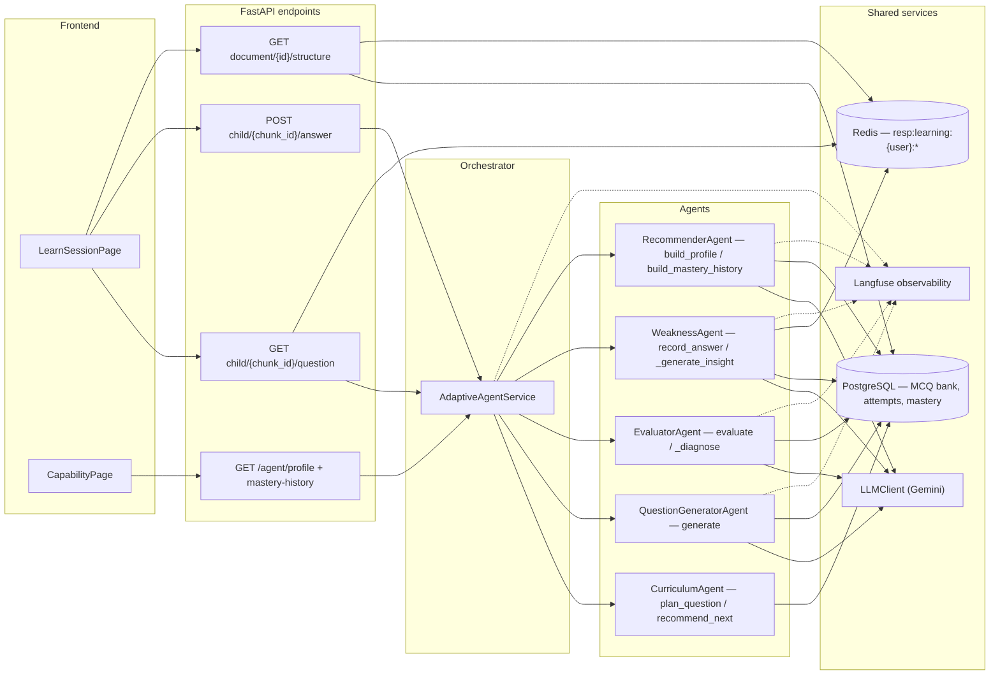
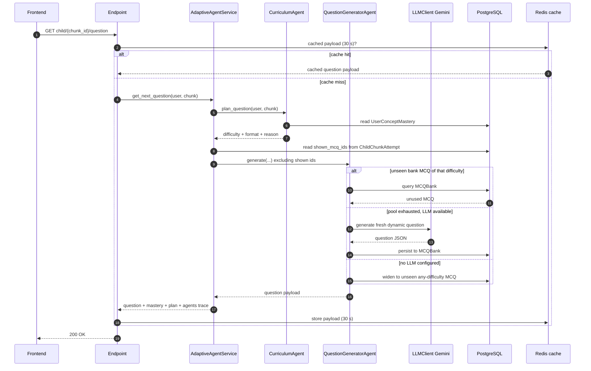
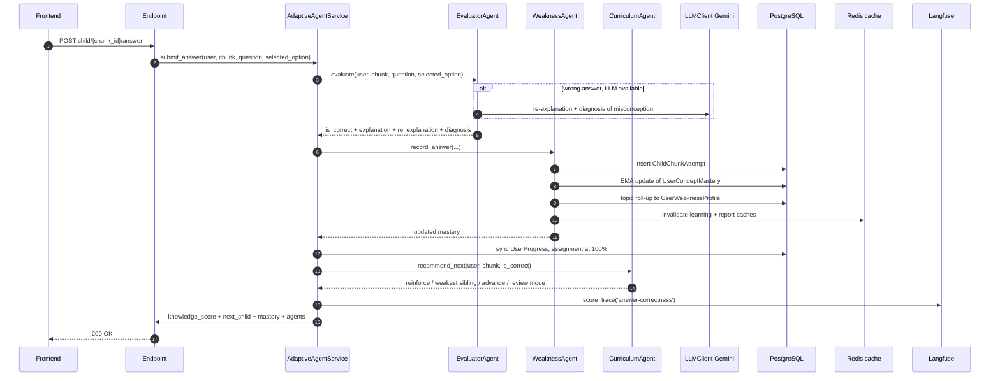
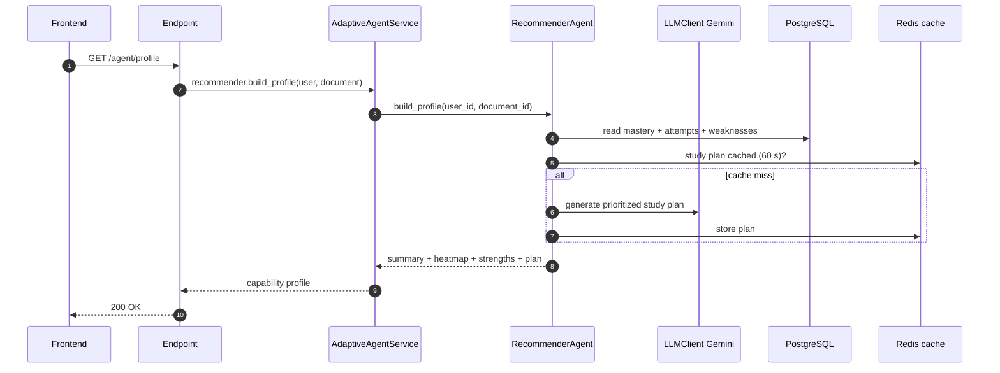

# Pulse LMS — Adaptive Learning Agent System

The whole AI learning loop of Pulse LMS (adaptive questions, evaluation,
weakness tracking, capability profiles, study plans) is driven by a small
**multi-agent system** in `app/agents/`. Every agent is deterministic where
possible (rule-based decisions, no LLM cost) and uses the LLM only for the
parts that genuinely need generation (question content, diagnosis, study
plans). Every LLM call is wrapped so failures degrade to deterministic
fallbacks — the learning flow never breaks because an LLM call failed.

---

## 1. Agent catalog

| Agent | File | Role |
|---|---|---|
| `BaseAgent` | `agents/base_agent.py` | Shared plumbing: lazy `LLMClient`, mastery bands, difficulty ladder |
| `CurriculumAgent` | `agents/curriculum_agent.py` | The "adaptivity brain" — decides *which* concept to target, at *what* difficulty/format, and *what to do next* |
| `QuestionGeneratorAgent` | `agents/question_generator_agent.py` | Builds the actual question — bank-first, dynamic Gemini on a miss |
| `EvaluatorAgent` | `agents/evaluator_agent.py` | Grades the answer and, on a wrong answer, diagnoses the missed concept |
| `WeaknessAgent` | `agents/weakness_agent.py` | Updates the per-concept mastery profile + topic roll-up after every answer |
| `RecommenderAgent` | `agents/recommender_agent.py` | Learner-facing capability dashboard: summary, weakness heatmap, strengths, study plan, score history |
| `AdaptiveAgentService` | `agents/adaptive_agent_service.py` | Orchestrator — wires the agents together and syncs progress |

There are **6 agents + 1 orchestrator**. `AdaptiveAgentService` is a service
rather than an agent itself; it owns the two public flows (question + answer)
and coordinates the other agents in the right order.

---

## 2. The shared model every agent relies on

Defined in `base_agent.py` and enforced by `WeaknessAgent` /
`AdaptiveMcqService`.

### Mastery bands (per concept, per user)

| Score range | Mastery level | Question difficulty shown |
|---|---|---|
| ≥ 85 | `mastered` | hard |
| 65 – 84 | `proficient` | hard |
| 40 – 64 | `learning` | medium |
| < 40 | `novice` | easy |

Constants: `WEAK_THRESHOLD = 65.0` (below → weak / needs review),
`CRITICAL_THRESHOLD = 40.0` (below → critical weakness).

### Score update (recency-weighted EMA)

```
correct:  score += (100 - score) * 0.25     # moves toward 100
wrong:    score *= 0.5                       # halves
```

Because the update is deterministic, the full score history can be **replayed
from the attempt log** — this is exactly how `RecommenderAgent.build_mastery_history`
rebuilds score-over-time charts without a separate history table.

### Section pass criterion (`AdaptiveMcqService`)

A parent section passes only after mastery, not a single correct answer — it
requires **at least 2 attempts**, with the **latest** attempt correct **and**
≥ 80% of the last **5** attempts correct (`MASTERY_WINDOW = 5`,
`MASTERY_RATIO = 0.8`).

The per-child `knowledge_score` returned to the UI is `100` if the parent
section is passed, else `0` — section mastery is the source of truth.

### Question formats by difficulty

| Difficulty | Formats | Style |
|---|---|---|
| easy | `objective` | simple recall / definition |
| medium | `objective`, `true_false` | application |
| hard | `scenario`, `objective` | analytical / scenario-based |

`CurriculumAgent` rotates the format across attempts
(recall → application → scenario) so consecutive questions differ even at the
same difficulty.

---

## 3. What each agent does

### 3.1 `BaseAgent`
Shared plumbing only:
- `llm()` — lazily builds a single `LLMClient` per agent instance.
- `mastery_level_for_score(score)` / `difficulty_for_level(level)` — the band
  and ladder mapping from the table above.
- `MASTERY_BANDS`, `WEAK_THRESHOLD`, `CRITICAL_THRESHOLD`, `DIFFICULTY_FOR_LEVEL`
  constants used by all agents.

### 3.2 `CurriculumAgent` — the adaptivity brain
Deterministic, no LLM cost.

- **`plan_question(user_id, chunk)`** → `{difficulty, format, reason}`.
  Reads the learner's `UserConceptMastery` row and:
  - first exposure (`attempts == 0`) → `easy`;
  - otherwise escalates with the mastery level (`novice→easy`,
    `learning→medium`, `proficient/mastered→hard`);
  - rotates the format so the learner sees a different question type per
    attempt.
- **`recommend_next(user_id, chunk, is_correct)`** → rule-based next action:
  1. concept still weak (`score < 65`) → **reinforce** the same concept with a
     fresh question;
  2. otherwise → **weakest sibling** in the section;
  3. section mastered → **advance** to the next section's first child;
  4. everything conquered → **review mode** (hard questions).

### 3.3 `QuestionGeneratorAgent` — builds the question
- **`generate(user_id, chunk, difficulty, prefer_format, exclude_mcq_ids)`**:
  1. **Bank-first** — serves an unused `MCQBank` row matching the chunk,
     difficulty, and format type (excluding all previously-shown MCQs).
  2. **No unseen MCQ of that difficulty** → generates a **fresh dynamic
     question via Gemini**, validates it (question + ≥2 options + a valid
     correct option — true/false has 2, objective has 4), and **persists it
     back to the bank** so the pool grows over time (no-repeat guarantee — a
     learner never loops the same question).
  3. **No LLM available** → widens to any *unseen* bank MCQ for the chunk
     (any difficulty) for variety; only reuses a seen MCQ as a last resort.
  4. **Deterministic fallback** when generation fails (a generic, still
     usable question referencing the page).
- Formats are generated from the difficulty-specific spec; dynamic questions
  are stored as `objective`/`true_false` rows.

### 3.4 `EvaluatorAgent` — grades and diagnoses
- **`evaluate(user_id, chunk, question_data, selected_option, time_taken)`**:
  - deterministic correctness check (`selected_option.upper()` vs
    `correct_option.upper()`);
  - correct → returns the stored explanation;
  - wrong → **`_diagnose`** calls Gemini for a **re-explanation** (what they
    should have understood, in plain language) + a one-line **diagnosis** of
    the likely misconception — both surfaced in the UI. If the LLM is
    unavailable, a deterministic re-explanation is returned.

### 3.5 `WeaknessAgent` — updates the capability profile
After every answer:
1. **`record_answer(...)`** — persists the `ChildChunkAttempt`, updates
   `UserConceptMastery` (EMA + band + consecutive-correct), rolls the concept
   score up to the topic-level `UserWeaknessProfile` (keeps NQ reports
   working), and invalidates the affected Redis response caches
   (`resp:learning:{user_id}:*`, `resp:report:*`).
2. **`_generate_insight`** — cost-guarded LLM diagnosis of *why* the learner
   is struggling, generated only when the concept is weak, has ≥ 2 attempts,
   and on a band change or every 5th attempt. Cleared when the learner
   recovers.

### 3.6 `RecommenderAgent` — the capability dashboard
Learner-facing, no writes:
- **`build_profile(user_id, document_id=None)`** — summary stats
  (mastered/proficient/learning/novice, weak, critical), a **weakness
  heatmap** (concepts below threshold with severity + LLM insights),
  **strengths**, per-topic and per-document roll-ups, and a **prioritized LLM
  study plan** (cached 60 s per user+document; deterministic fallback plan
  when the LLM is unavailable).
- **`build_mastery_history(user_id, document_id=None)`** — replays every
  `ChildChunkAttempt` through the EMA to reconstruct each concept's
  score-over-time trajectory, plus a document-average overlay.

### 3.7 `AdaptiveAgentService` — orchestrator
Owns the two public flows (below) and produces the `agents` decision trace
(`curriculum`, `question_generator`, `evaluator`, `weakness`) that the UI
renders. Also syncs `UserProgress` and auto-completes the training assignment
at 100%.

---

## 4. How the agents work together (flows)

### Architecture overview

One picture of the system: the frontend hits REST endpoints,
`AdaptiveAgentService` coordinates the five agents, and everything reads/writes
PostgreSQL with Redis response caching and Langfuse observability around the
LLM calls.



### Flow A — "Give me the next question"

```
GET /learning/session/child/{chunk_id}/question
        │
        ▼
AdaptiveAgentService.get_next_question(user, chunk)
  │ 1. CurriculumAgent.plan_question()          → difficulty + format + reason
  │ 2. read shown_mcq_ids from ChildChunkAttempt (exclude repeats)
  │ 3. QuestionGeneratorAgent.generate()         → bank MCQ OR new dynamic question
  │ 4. attach mastery block + plan + agents trace
        │
        ▼
response: {question, options, correct_option, explanation, difficulty,
           format, mcq_id, is_dynamic, mastery, plan, agents}
```

Same chain as a Mermaid sequence diagram:



The response is cached per user for 30 s (`resp:learning:{user}:question:{chunk}`)
and cleared automatically when the answer is submitted.

### Flow B — "I submitted an answer"

```
POST /learning/session/child/{chunk_id}/answer
        │
        ▼
AdaptiveAgentService.submit_answer(user, chunk, question_data, selected_option)
  │ 1. EvaluatorAgent.evaluate()                 → is_correct, explanation,
  │                                                re_explanation, diagnosis
  │ 2. WeaknessAgent.record_answer()             → attempt row + EMA mastery
  │                                                update + topic roll-up +
  │                                                cache invalidation
  │ 3. _sync_user_progress()                     → UserProgress %, assignment
  │                                                completion at 100%
  │ 4. CurriculumAgent.recommend_next()          → reinforce / weakest sibling /
  │                                                advance / review mode
  │ 5. knowledge_score + child_passed (section criterion)
  │ 6. _compute_next_step()                      → next child chunk
  │ 7. Langfuse score_trace('answer-correctness')
        │
        ▼
response: {is_correct, correct_option, explanation, re_explanation, diagnosis,
           child_passed, knowledge_score, attempt_number, difficulty,
           next_child, parent_completed, document_completed, mastery,
           recommendation, agents}
```

Same chain as a Mermaid sequence diagram:



### Flow C — "Show my capability profile / history"

```
GET /agent/profile{/document_id}   → AdaptiveAgentService.recommender.build_profile
GET /agent/mastery-history         → AdaptiveAgentService.recommender.build_mastery_history
GET /learning/session/document/{id}/structure  → per-user tree + progress
```

The RecommenderAgent chain as a Mermaid sequence diagram:



### Cross-cutting behaviors

- **Caching** — structure (60 s), question (30 s), and study plan (60 s)
  responses are cached per user in Redis and invalidated on every answer
  (both the adaptive and legacy answer paths call `invalidate_cached`).
- **Observability** — every flow is wrapped in Langfuse observations
  (`adaptive-question`, `adaptive-answer`, `evaluator`, `weakness-update`,
  `curriculum-next-step`, generation calls) and scored by the LLM-as-judge
  evals (`answer-correctness`, `qa-groundedness`, `mcq-quality`). See
  `README.md → Langfuse observability`.
- **Graceful degradation** — every agent has a deterministic fallback for LLM
  failures, and the orchestrator never 500s the dashboard on agent errors.

---

## 5. Files involved

| Concern | Files |
|---|---|
| Agents | `app/agents/*.py` |
| Mastery / attempt logic | `app/services/adaptive_mcq_service.py` |
| Progress sync (legacy) | `app/services/learning_session_service.py` |
| API endpoints | `app/api/v1/endpoints/learning_session.py` |
| LLM client | `app/clients/llm_client.py` |
| Mastery + attempt data | `app/models/user_concept_mastery.py`, `app/models/child_chunk_attempt.py`, `app/models/parent_chunk_progress.py` |
| LLM-as-judge evals | `app/evals/judges.py` |
| Frontend | `Frontend/src/pages/trainee/LearnSessionPage.jsx`, `CapabilityPage.jsx` |

---

## 6. Quick troubleshooting

- **"Same question keeps repeating"** — should no longer happen: the question
  generator excludes shown MCQs and generates fresh dynamic questions when a
  difficulty's pool is exhausted. If repeats persist, check `mcq_id` values in
  `child_chunk_attempts` for the user+chunk.
- **Difficulty never changes** — the difficulty ladder follows the mastery
  score: 2 consecutive correct answers move `novice → learning` (medium
  questions), 4 reach `proficient` (hard questions) — each correct answer is
  +25 % of the remaining gap to 100.
- **Answers never pass a section** — the section criterion requires ≥4 of the
  last 5 attempts correct with the latest correct; correct-then-wrong streaks
  reset `consecutive_correct`.
- **Study plan / insights missing** — LLM calls are cost-guarded and fall back
  deterministically; check `gemini_api_key` is configured and Langfuse ingest
  is healthy.
